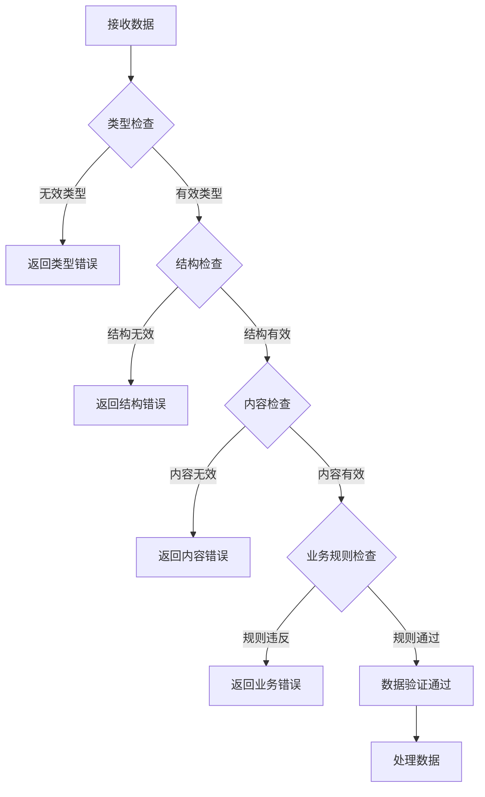

# 数据验证规则

以下是电路设计系统的数据验证规则，确保系统能够正确验证和处理各种数据情况。

## 1. 输入验证规则

### 1.1 自然语言输入验证

| 规则 | 描述 | 示例 | 错误提示 |
|------|------|------|----------|
| 非空检查 | 输入文本不能为空 | "" | "请输入电路设计请求" |
| 长度限制 | 输入文本长度应在10-500字符之间 | "设计电路" | "输入长度应在10-500字符之间" |
| 格式检查 | 输入文本应包含电路相关关键词 | "今天天气真好" | "请输入有效的电路设计请求" |
| 内容限制 | 禁止包含敏感词或攻击性语言 | "@#$%^&*" | "输入包含无效字符" |

### 1.2 API请求验证

| 规则 | 描述 | 示例 | 错误提示 |
|------|------|------|----------|
| Content-Type检查 | 请求必须为JSON格式 | Content-Type: text/plain | "请求必须为JSON格式" |
| 参数完整性 | 必要参数必须存在 | 缺少input_text | "缺少必要参数: input_text" |
| 参数类型 | 参数类型必须正确 | input_text: 123 | "参数类型错误，input_text应为字符串" |
| 授权检查 | 需要授权的API必须提供有效令牌 | 无效JWT令牌 | "未授权访问" |

## 2. AI解析服务数据验证

### 2.1 输出数据结构验证

| 规则 | 描述 | 示例 | 错误提示 |
|------|------|------|----------|
| 结构完整性 | 必须包含components、connections和constraints | 缺少connections | "电路设计数据不完整" |
| 数组类型 | components和connections必须为数组 | components: { ... } | "components必须为数组" |
| 对象类型 | constraints必须为对象 | constraints: "5V" | "constraints必须为对象" |
| 非空检查 | components和connections数组不能为空 | components: [] | "components数组不能为空" |

### 2.2 组件数据验证

| 规则 | 描述 | 示例 | 错误提示 |
|------|------|------|----------|
| 类型必填 | 组件必须有type属性 | 缺少type | "组件缺少type属性" |
| 类型有效值 | type必须为有效组件类型 | type: "unknown" | "无效的组件类型" |
| 模型验证 | 微控制器等组件必须有model | type: "microcontroller"且无model | "微控制器组件必须有model" |
| 值验证 | 电阻电容等必须有value | type: "resistor"且无value | "电阻组件必须有value" |
| 值格式 | value必须符合电气值格式 | value: "220ohm" | "值格式无效，应为220Ω" |
| 引脚验证 | 引脚数组必须包含有效引脚 | pins: [{name: "", number: "A"}] | "无效的引脚数据" |

### 2.3 连接数据验证

| 规则 | 描述 | 示例 | 错误提示 |
|------|------|------|----------|
| 完整性 | 连接必须有from和to属性 | 缺少from | "连接缺少from属性" |
| 格式 | 连接格式必须为Component.Pin | from: "Arduino" | "连接格式无效，应为Component.Pin" |
| 存在性 | 连接的组件和引脚必须存在 | from: "Unknown.Pin1" | "组件Unknown不存在" |
| 唯一性 | 连接不能重复 | from: "A.P1", to: "B.P2"重复出现 | "连接已存在" |

### 2.4 约束数据验证

| 规则 | 描述 | 示例 | 错误提示 |
|------|------|------|----------|
| 电压范围 | 电压值必须在合理范围内 | voltage: "1000V" | "电压值超出合理范围" |
| 电流范围 | 电流值必须在合理范围内 | current_limit: "10A" | "电流值超出合理范围" |
| 格式检查 | 电压电流格式必须正确 | voltage: "5" | "电压格式无效，应为5V" |

## 3. EDA生成服务数据验证

### 3.1 网表生成验证

| 规则 | 描述 | 示例 | 错误提示 |
|------|------|------|----------|
| 组件存在 | 网表必须包含至少一个组件 | 无组件 | "网表至少需要一个组件" |
| 连接存在 | 至少需要一个有效连接 | 无连接 | "网表至少需要一个连接" |
| 组件类型 | 所有组件必须为SKiDL支持类型 | 无效组件类型 | "不支持的组件类型" |
| 连接有效性 | 所有连接必须连接到有效引脚 | 连接到无效引脚 | "连接到无效引脚" |

### 3.2 原理图生成验证

| 规则 | 描述 | 示例 | 错误提示 |
|------|------|------|----------|
| 网表有效性 | 提供的网表必须有效 | 无效网表格式 | "无效的网表数据" |
| 组件库 | 所有组件必须有对应的KiCad库 | 缺少组件库 | "组件缺少对应的KiCad库" |
| 引脚映射 | 组件引脚必须正确映射 | 引脚映射错误 | "组件引脚映射错误" |

### 3.3 PCB生成验证

| 规则 | 描述 | 示例 | 错误提示 |
|------|------|------|----------|
| 原理图有效性 | 提供的原理图必须有效 | 无效原理图 | "无效的原理图数据" |
| 板尺寸 | PCB尺寸必须在合理范围内 | size: "10mmx10mm" | "PCB尺寸过小" |
| 层数 | PCB层数必须为支持的值 | layers: 3 | "只支持2、4、6层PCB" |
| 线宽 | 线宽必须符合制造要求 | trace_width: "0.1mm" | "线宽不符合制造要求" |

### 3.4 BOM生成验证

| 规则 | 描述 | 示例 | 错误提示 |
|------|------|------|----------|
| 组件列表 | 必须包含组件列表 | 无组件 | "BOM至少需要一个组件" |
| 数量验证 | 组件数量必须为正整数 | quantity: 0 | "组件数量必须为正整数" |
| 描述完整性 | 组件必须有基本描述 | description: "" | "组件缺少描述" |

## 4. 存储数据验证

### 4.1 文件验证

| 规则 | 描述 | 示例 | 错误提示 |
|------|------|------|----------|
| 文件类型 | 只允许特定类型的文件 | .exe文件 | "不支持的文件类型" |
| 文件大小 | 文件大小不超过10MB | 20MB文件 | "文件大小超过限制" |
| 格式检查 | 文件格式必须有效 | 损坏的PDF | "无效的文件格式" |
| 唯一性 | 文件名必须唯一 | 重复文件名 | "文件名已存在" |

### 4.2 数据库记录验证

| 规则 | 描述 | 示例 | 错误提示 |
|------|------|------|----------|
| 主键完整性 | 主键必须唯一且非空 | 重复ID | "主键重复" |
| 外键约束 | 外键必须指向存在的记录 | 无效的设计ID | "外键指向不存在的记录" |
| 数据类型 | 字段类型必须正确 | 字符串存储为数字 | "数据类型错误" |
| 时间戳 | 创建和更新时间必须有效 | 未来时间戳 | "时间戳无效" |

## 5. 实时通信数据验证

### 5.1 WebSocket消息验证

| 规则 | 描述 | 示例 | 错误提示 |
|------|------|------|----------|
| 消息类型 | 必须包含message_type字段 | 缺少message_type | "缺少消息类型" |
| 消息格式 | 消息格式必须正确 | 无效JSON格式 | "无效的消息格式" |
| 会话验证 | 消息必须包含有效会话ID | 无效会话ID | "无效的会话ID" |
| 内容限制 | 消息内容长度限制 | 过长的消息 | "消息内容过长" |

### 5.2 事件数据验证

| 规则 | 描述 | 示例 | 错误提示 |
|------|------|------|----------|
| 事件类型 | 必须为有效事件类型 | event: "invalid_event" | "无效的事件类型" |
| 数据完整性 | 事件数据必须完整 | 缺少设计ID | "事件数据不完整" |
| 状态值 | 状态值必须为有效状态 | status: "unknown" | "无效的状态值" |

## 6. 验证实现建议

### 6.1 前端验证

1. 使用HTML5表单验证进行基本验证
2. 使用JavaScript进行更复杂的验证逻辑
3. 在提交前验证所有输入字段
4. 提供即时反馈和错误提示
5. 防止重复提交

### 6.2 后端验证

1. 使用Pydantic或类似库进行请求体验证
2. 对所有API请求进行输入验证
3. 实现集中式错误处理
4. 记录详细的验证错误日志
5. 提供清晰的错误信息

### 6.3 服务间验证

1. 每个服务应验证接收到的数据
2. 使用共享的数据模型和验证规则
3. 实现防御性编程，不假设其他服务的输入有效
4. 提供详细的服务间错误信息
5. 实现重试和容错机制

## 7. 验证流程图

## 8. 错误码定义

| 错误码 | 描述 | HTTP状态码 |
|--------|------|------------|
| 40001 | 输入为空 | 400 |
| 40002 | 输入长度不符合要求 | 400 |
| 40003 | 输入格式无效 | 400 |
| 40004 | 缺少必要参数 | 400 |
| 40005 | 参数类型错误 | 400 |
| 40101 | 未授权访问 | 401 |
| 40102 | 令牌过期 | 401 |
| 40103 | 令牌无效 | 401 |
| 40401 | 资源不存在 | 404 |
| 50001 | 系统内部错误 | 500 |
| 50002 | AI解析失败 | 500 |
| 50003 | EDA生成失败 | 500 |
| 50004 | 存储服务错误 | 500 |
| 50301 | 服务不可用 | 503 |
