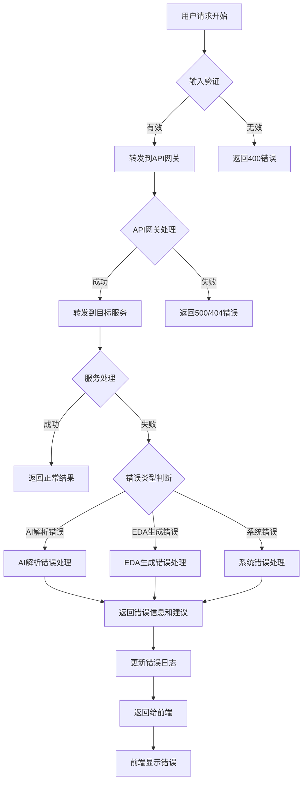
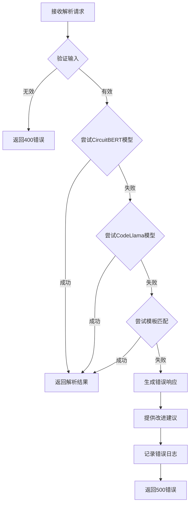
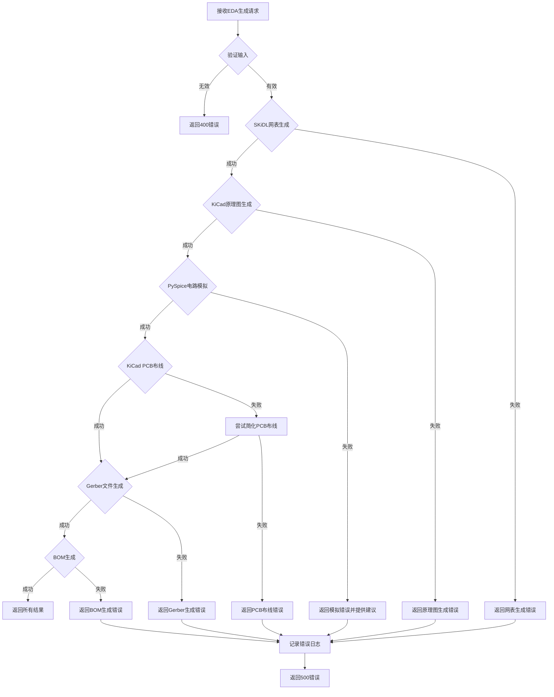
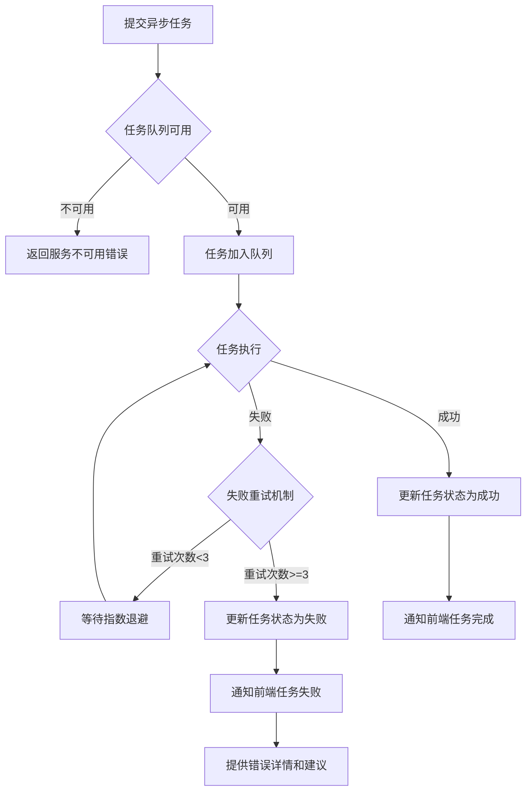
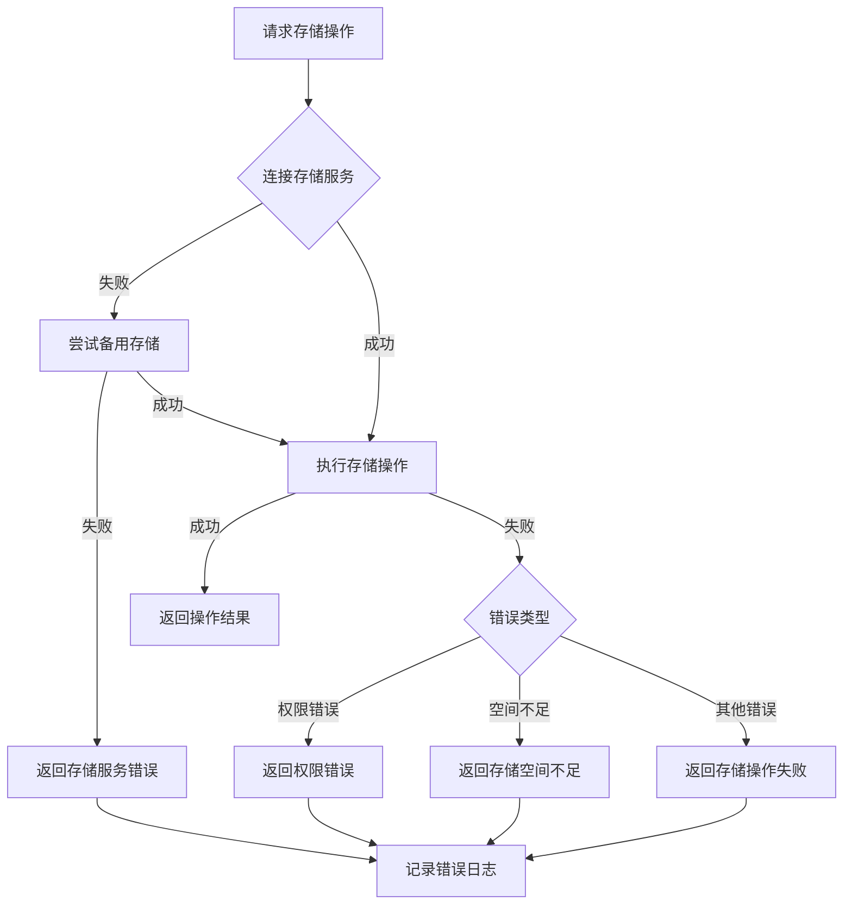
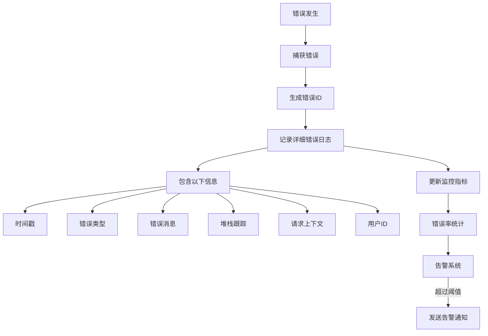
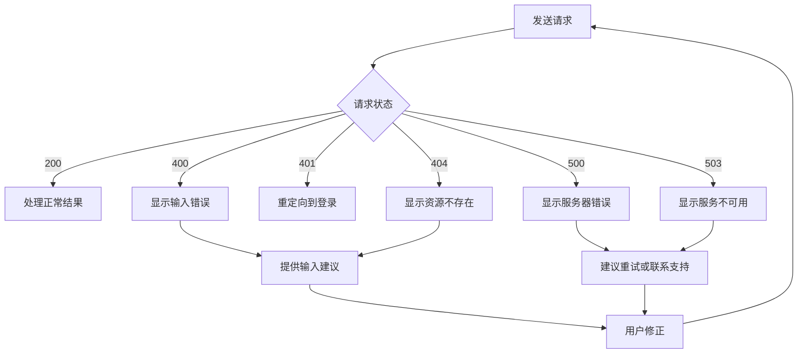

# 错误处理流程图

以下是电路设计系统的错误处理流程图，展示了系统如何处理各种错误情况和异常场景。

## 1. 系统错误处理总览

## 2. AI解析服务错误处理

## 3. EDA生成服务错误处理

## 4. 异步任务错误处理

## 5. 存储服务错误处理

## 6. 错误类型和处理策略

| 错误类型 | 错误代码 | 处理策略 | 建议 |
|---------|---------|---------|------|
| 输入验证错误 | 400 | 返回详细错误信息 | 检查输入格式和内容 |
| AI解析失败 | 500 | 尝试降级方案 | 简化请求或提供更明确的描述 |
| 网表生成失败 | 500 | 返回技术错误详情 | 检查电路结构和组件 |
| 原理图生成失败 | 500 | 返回KiCad错误日志 | 检查组件库和连接定义 |
| 电路模拟失败 | 500 | 提供修改建议 | 检查电路约束和组件参数 |
| PCB布线失败 | 500 | 尝试简化布线 | 增加PCB尺寸或减少组件数量 |
| 任务队列错误 | 503 | 延迟重试 | 稍后重试或联系管理员 |
| 存储服务错误 | 500 | 尝试备用存储 | 检查存储配置和权限 |
| 系统内部错误 | 500 | 记录详细日志 | 联系管理员 |

## 7. 错误日志和监控

## 8. 前端错误处理流程

这些错误处理流程图展示了系统如何处理各种错误情况，确保系统在遇到异常时能够优雅地处理，并为用户提供清晰的错误信息和改进建议。错误处理机制遵循以下原则：

1. **快速失败**：在系统早期发现并处理错误
2. **降级策略**：当高级服务不可用时，尝试使用备用方案
3. **重试机制**：对可恢复的错误进行指数退避重试
4. **用户友好**：提供清晰的错误信息和改进建议
5. **可监控性**：详细记录错误日志，便于排查和监控
6. **可恢复性**：确保系统在错误发生后能够恢复正常运行