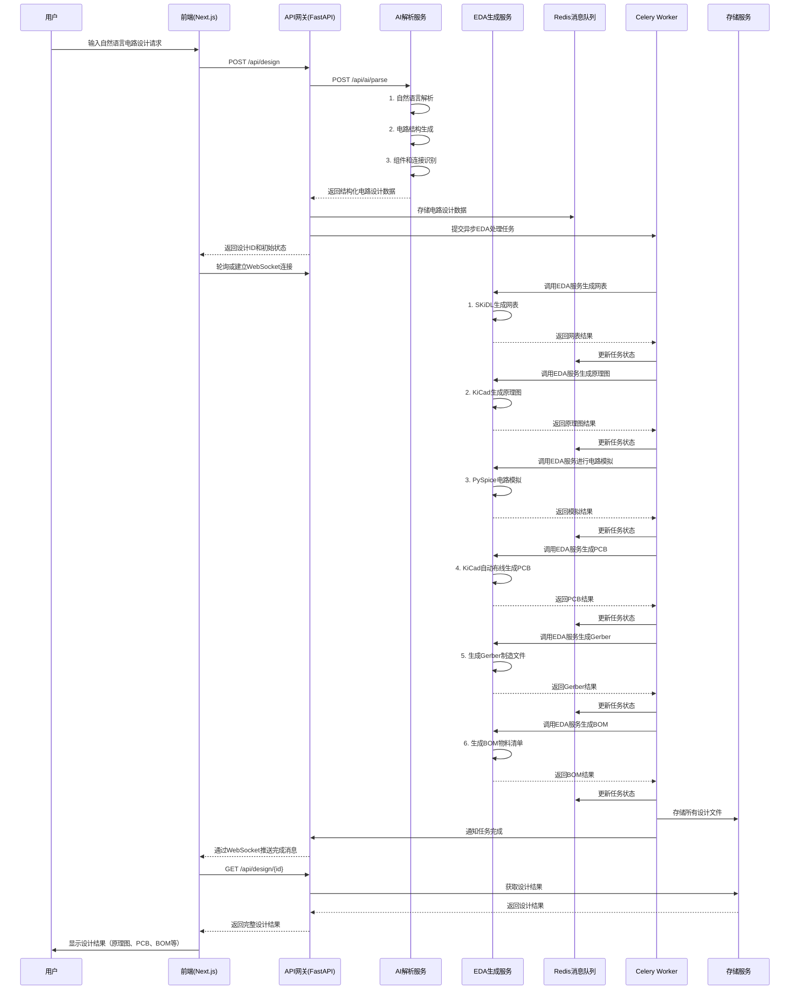
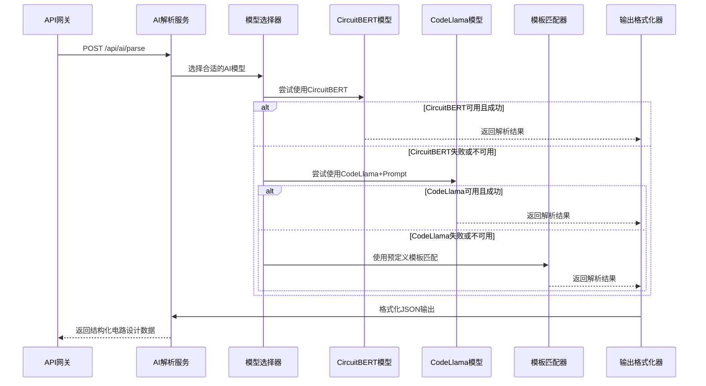
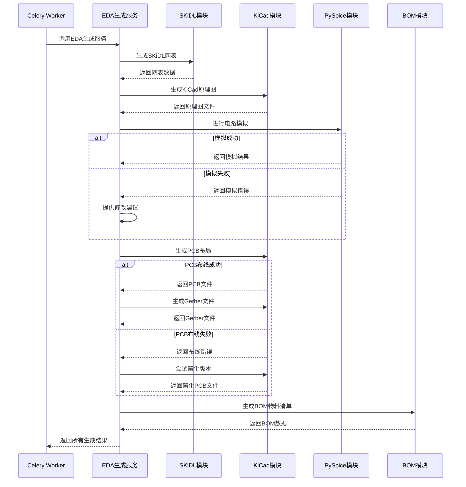
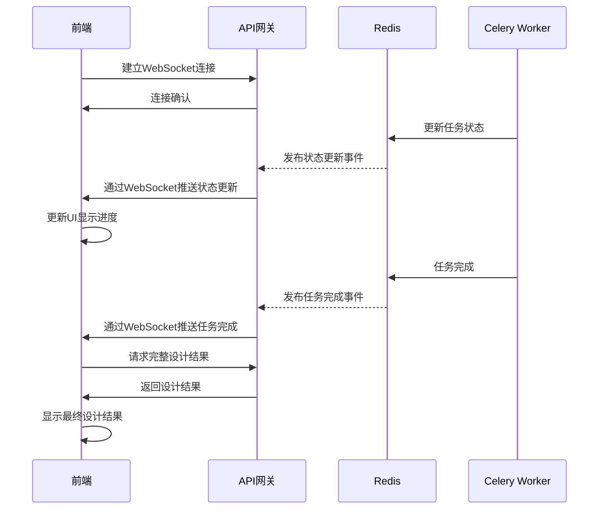

# 服务间调用序列图

以下是电路设计系统的服务间调用序列图，展示了从用户输入自然语言请求到最终生成电路设计结果的完整流程。

## 1. 完整电路设计流程

```mermaid
sequenceDiagram
    participant User as 用户
    participant Frontend as 前端(Next.js)
    participant APIGateway as API网关(FastAPI)
    participant AIService as AI解析服务
    participant EDAService as EDA生成服务
    participant Redis as Redis消息队列
    participant Celery as Celery Worker
    participant Storage as 存储服务

    User->>Frontend: 输入自然语言电路设计请求
    Frontend->>APIGateway: POST /api/design
    APIGateway->>AIService: POST /api/ai/parse
    AIService->>AIService: 1. 自然语言解析
    AIService->>AIService: 2. 电路结构生成
    AIService->>AIService: 3. 组件和连接识别
    AIService-->>APIGateway: 返回结构化电路设计数据
    APIGateway->>Redis: 存储电路设计数据
    APIGateway->>Celery: 提交异步EDA处理任务
    APIGateway-->>Frontend: 返回设计ID和初始状态
    Frontend->>APIGateway: 轮询或建立WebSocket连接
    Celery->>EDAService: 调用EDA服务生成网表
    EDAService->>EDAService: 1. SKiDL生成网表
    EDAService-->>Celery: 返回网表结果
    Celery->>Redis: 更新任务状态
    Celery->>EDAService: 调用EDA服务生成原理图
    EDAService->>EDAService: 2. KiCad生成原理图
    EDAService-->>Celery: 返回原理图结果
    Celery->>Redis: 更新任务状态
    Celery->>EDAService: 调用EDA服务进行电路模拟
    EDAService->>EDAService: 3. PySpice电路模拟
    EDAService-->>Celery: 返回模拟结果
    Celery->>Redis: 更新任务状态
    Celery->>EDAService: 调用EDA服务生成PCB
    EDAService->>EDAService: 4. KiCad自动布线生成PCB
    EDAService-->>Celery: 返回PCB结果
    Celery->>Redis: 更新任务状态
    Celery->>EDAService: 调用EDA服务生成Gerber
    EDAService->>EDAService: 5. 生成Gerber制造文件
    EDAService-->>Celery: 返回Gerber结果
    Celery->>Redis: 更新任务状态
    Celery->>EDAService: 调用EDA服务生成BOM
    EDAService->>EDAService: 6. 生成BOM物料清单
    EDAService-->>Celery: 返回BOM结果
    Celery->>Redis: 更新任务状态
    Celery->>Storage: 存储所有设计文件
    Celery->>APIGateway: 通知任务完成
    APIGateway-->>Frontend: 通过WebSocket推送完成消息
    Frontend->>APIGateway: GET /api/design/{id}
    APIGateway->>Storage: 获取设计结果
    Storage-->>APIGateway: 返回设计结果
    APIGateway-->>Frontend: 返回完整设计结果
    Frontend->>User: 显示设计结果（原理图、PCB、BOM等）
```

## 2. AI解析服务内部流程

```mermaid
sequenceDiagram
    participant APIGateway as API网关
    participant AIService as AI解析服务
    participant ModelSelector as 模型选择器
    participant CircuitBERT as CircuitBERT模型
    participant CodeLlama as CodeLlama模型
    participant TemplateMatcher as 模板匹配器
    participant OutputFormatter as 输出格式化器

    APIGateway->>AIService: POST /api/ai/parse
    AIService->>ModelSelector: 选择合适的AI模型
    ModelSelector->>CircuitBERT: 尝试使用CircuitBERT
    alt CircuitBERT可用且成功
        CircuitBERT-->>OutputFormatter: 返回解析结果
    else CircuitBERT失败或不可用
        ModelSelector->>CodeLlama: 尝试使用CodeLlama+Prompt
        alt CodeLlama可用且成功
            CodeLlama-->>OutputFormatter: 返回解析结果
        else CodeLlama失败或不可用
            ModelSelector->>TemplateMatcher: 使用预定义模板匹配
            TemplateMatcher-->>OutputFormatter: 返回解析结果
        end
    end
    OutputFormatter->>AIService: 格式化JSON输出
    AIService-->>APIGateway: 返回结构化电路设计数据
```

## 3. EDA生成服务内部流程

```mermaid
sequenceDiagram
    participant Celery as Celery Worker
    participant EDAService as EDA生成服务
    participant SKiDLModule as SKiDL模块
    participant KiCadModule as KiCad模块
    participant PySpiceModule as PySpice模块
    participant BOMModule as BOM模块

    Celery->>EDAService: 调用EDA生成服务
    EDAService->>SKiDLModule: 生成SKiDL网表
    SKiDLModule-->>EDAService: 返回网表数据
    EDAService->>KiCadModule: 生成KiCad原理图
    KiCadModule-->>EDAService: 返回原理图文件
    EDAService->>PySpiceModule: 进行电路模拟
    alt 模拟成功
        PySpiceModule-->>EDAService: 返回模拟结果
    else 模拟失败
        PySpiceModule-->>EDAService: 返回模拟错误
        EDAService->>EDAService: 提供修改建议
    end
    EDAService->>KiCadModule: 生成PCB布局
    alt PCB布线成功
        KiCadModule-->>EDAService: 返回PCB文件
        EDAService->>KiCadModule: 生成Gerber文件
        KiCadModule-->>EDAService: 返回Gerber文件
    else PCB布线失败
        KiCadModule-->>EDAService: 返回布线错误
        EDAService->>KiCadModule: 尝试简化版本
        KiCadModule-->>EDAService: 返回简化PCB文件
    end
    EDAService->>BOMModule: 生成BOM物料清单
    BOMModule-->>EDAService: 返回BOM数据
    EDAService-->>Celery: 返回所有生成结果
```

## 4. WebSocket实时通知流程

```mermaid
sequenceDiagram
    participant Frontend as 前端
    participant APIGateway as API网关
    participant Redis as Redis
    participant Celery as Celery Worker

    Frontend->>APIGateway: 建立WebSocket连接
    APIGateway->>Frontend: 连接确认
    Celery->>Redis: 更新任务状态
    Redis-->>APIGateway: 发布状态更新事件
    APIGateway->>Frontend: 通过WebSocket推送状态更新
    Frontend->>Frontend: 更新UI显示进度
    Celery->>Redis: 任务完成
    Redis-->>APIGateway: 发布任务完成事件
    APIGateway->>Frontend: 通过WebSocket推送任务完成
    Frontend->>APIGateway: 请求完整设计结果
    APIGateway->>Frontend: 返回设计结果
    Frontend->>Frontend: 显示最终设计结果
```

这些序列图展示了系统中各个服务之间的交互方式和数据流，帮助理解系统的工作原理和各组件之间的关系。